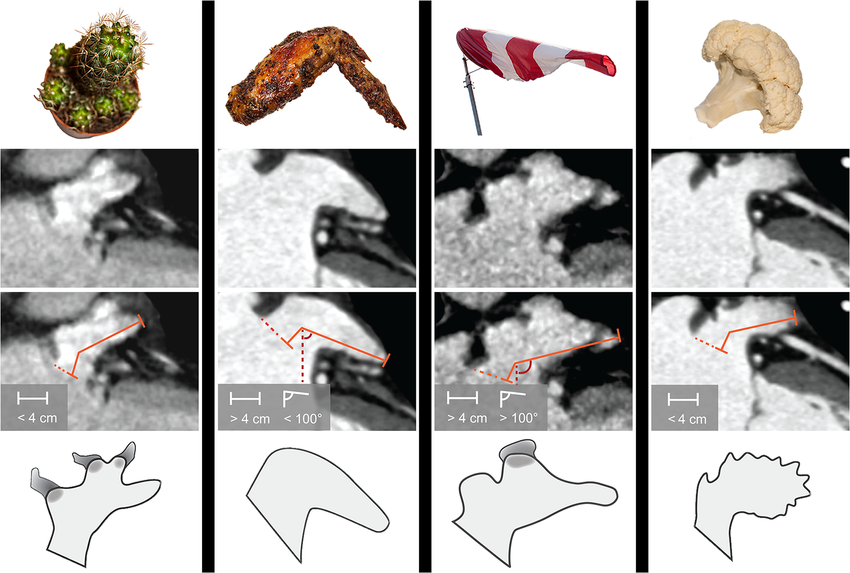

# Problem

A stroke is a pathological condition in which the blood flow to the brain is stopped.
The most common cause is the formation of a blood clot (thrombus). Most atrial thrombi form in the left atrial appendage (LAA), with greater or lesser incidence depending on the patient morphology. Many studies have investigated this variability using imaging techniques.

Four principal forms (reported in Figure, taken from [this article](https://journals.plos.org/plosone/article?id=10.1371/journal.pone.0118822)) have been identified:
 1. Cactus,
 2. Chicken Wing,
 3. Windsock,
 4. Cauliflower.

.

The objectives of this homework are:
 1. to develop a 2D shape model that contains the principal forms of LAA.
 2. to numerically approximate a 2D flow in the LAA, assuming a constant velocity at the entrance of the LAA in the direction perpendicular to the LAA main axis (adaptation of the cavity test case).
 3. define one or more indicators based on approximated velocity distribution that might help predict the risk of ischemic stroke formation.